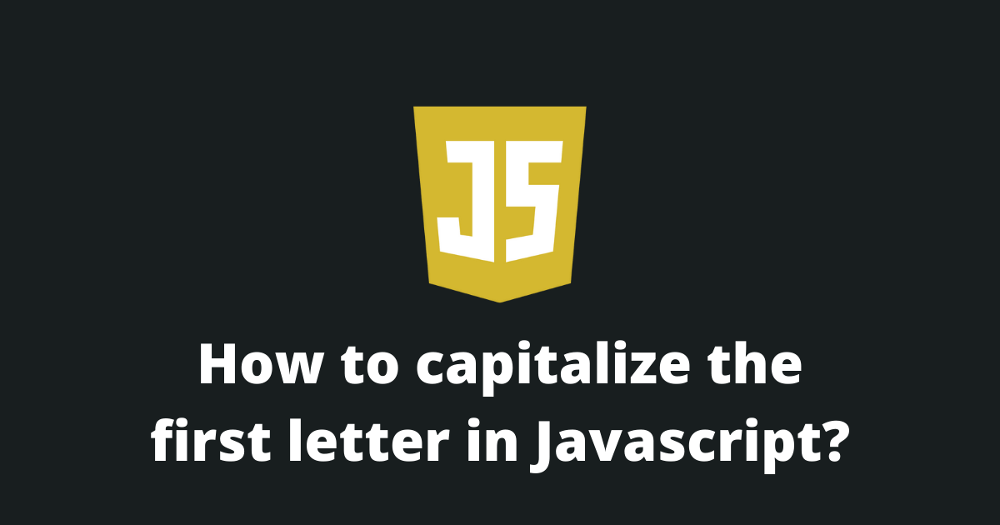
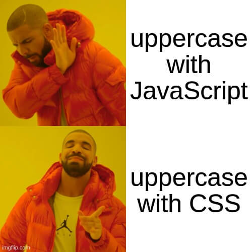
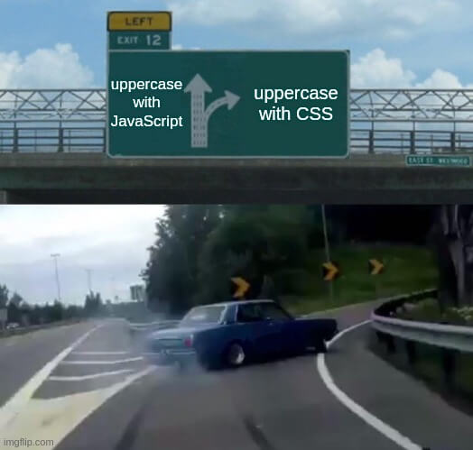

In JavaScript, there is a lot of different ways to capitalize the first letter of a string.

You can capitalize the first letter with a combination of built-in javascript functions, with regex expressions and, even with CSS.

Read this article to find out your favorite new way. 😎

<Summary />

## How to capitalize the first letter in JavaScript?

### 1. Using the `charAt()` with the `slice()` function

To capitalize the first letter of a string you need to follow these steps:

1. Get the first character with the `charAt()` function
3. Uppercase it with the `toUpperCase()` function.
2. Concatenate the rest of the string to the uppercased character.

```javascript
const str = "this is a very long string!";

// This will return: "This is a very long string!"
console.log(str.charAt(0).toUpperCase() + str.slice(1));
```

### 2. Using the `replace()` function

You can also capitalize the first letter of a string by using the `replace()` function and a regex.

1. You create a regex that will only match the first character (this is the regex: `/./`).
2. With the `replace()` function, you uppercase the first character by matching the regex.

```javascript
const str = "this is a very long string!";

// This will return: "This is a very long string!"
console.log(str.replace(/./, c => c.toUpperCase()));
```

### 3. Using CSS

You can also capitalize the first letter using the CSS `text-transform` property and the `::first-letter` selector.




```javascript
<div id="my_title">this is a very long string!</div>
<style>
	#my_title::first-letter {
		text-transform: capitalize;
	}
</style>
```

### 4. Using Lodash

Alternatively, you can use [lodash](https://lodash.com/docs/#capitalize) to do this for you.

Lodash has a special `capitalize()` function.

```javascript
const str = "this is a very long string!";

_.capitalize(str);
```

## How to capitalize the first letter of each word?

### 1. Using a regex

To capitalize the first letter of each word you can use the `replace()` function with a regex.

```javascript
const str = 'this is a very long string!';

// This will return: "This Is A Very Long String!"
console.log(str.replace(/(^\w|\s\w)/g, m => m.toUpperCase()));
```

Here is a table explaining this regex:

| Characters | Meaning |
| ---------- | ------- |
| ^ | Matches the beginning of an input. |
| \w | Matches any alphanumeric character. |
| \s | Matches a single whitespace character. |

> The `g` modifier means global. It means that the regex will find all matches.

### 2. Using the `map()` function

Also, you can capitalize the first letter of each word by following these steps:

1. Make all the text lowercase.
2. Split all the words inside an array.
3. Iterate through each word inside the array using the `map()` function and uppercase the first letter.
4. Transform the array into a string using the `join()` function.

```javascript
let str = 'this is a very long string!';

str = str.toLowerCase()
    .split(' ')
    .map((s) => s.charAt(0).toUpperCase() + s.substring(1))
    .join(' ');

// This will return: "This Is A Very Long String!"
console.log(str);
```

### 3. Using a `for` loop

You can also capitalize the first letter of each word by looping through each word with a `for` loop.

```javascript
const words = 'this is a very long string!'.split(" ");

for (let i = 0; i < words.length; i++) {
    words[i] = words[i][0].toUpperCase() + words[i].substr(1);
}

const str = words.join(' ');

// This will return: "This Is A Very Long String!"
console.log(str);
```

### 4. Using CSS

If you don't want to use JavaScript, we have good news for you!

You can use the CSS `text-transform` property to archive the same result.



```javascript
<div id="my_title">this is a very long string!</div>
<style>
	#my_title {
		text-transform: capitalize;
	}
</style>
```

## Final Thoughts

As you can see, there is a lot of different ways to choose from when you want to capitalize the first letter of a string.

In my case, when I develop a new application, I create a helper function called `capitalize(str: string)` in my utils file and import it whenever I need to use it.

I hope you liked this article, please share it!