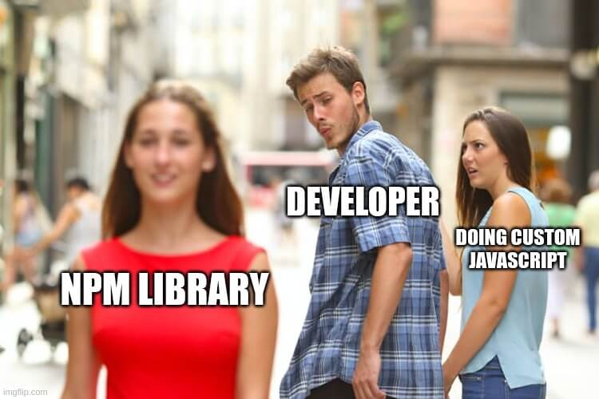

When it comes to rounding a number to two decimal places in JavaScript, the developer has a lot of options.

You can use:

1. The `toFixed()` function.

2. The `Math.round()` function.

3. The helper function.

4. An external npm library.

In this article, I will show you how to use each one of them.


<Summary />

## How to round a number using the `toFixed()` function?

The first and easiest solution is to use the `toFixed()` function.

```javascript
const number = 18.154;

// OUTPUT: 18.15
console.log(parseFloat(number.toFixed(2)));
```

The output of this is: **18.15**

> This method is the easiest but not the most accurate one...
>
> For example: for `4.005` it will give `4`.


## How to round a number using the `Math.round()` function?

You can round a number to the 2 decimal places by using the `Math.round()` function.

```javascript
const number = 18.154;

// OUTPUT: 18.15
console.log(Math.round((number + Number.EPSILON) * 100) / 100);
```

The output of this is: **18.15**

## How to round a number using a custom helper function?

You can also round a number by creating a helper function that will use the `Math.round()` function and some JavaScript magic.

```javascript
const number = 18.154;

function roundTo(n, place) {    
    return +(Math.round(n + "e+" + place) + "e-" + place);
}
// OUTPUT: 18.15
console.log(roundTo(number, 2));
```

The output of this is: **18.15**

## How to round a number with an npm library.

Rounding a number can be hard to do by yourself because you need to think about a lot of use cases.



That's why you can install a library that will do it for you.

Here is an example of how to do it with the [round-to](https://www.npmjs.com/package/round-to) library.

```javascript
import { roundTo } from 'round-to';

// OUTPUT: 18.15
console.log(roundTo(18.154, 2);)
```

The output of this is: **18.15**

## Final Thoughts

As you can see you have a lot of options to round a number to a specific decimal place.

For my part, I use the helper function method. I just create it as a utility function and import it when I need it.

Thank you for reading this article.