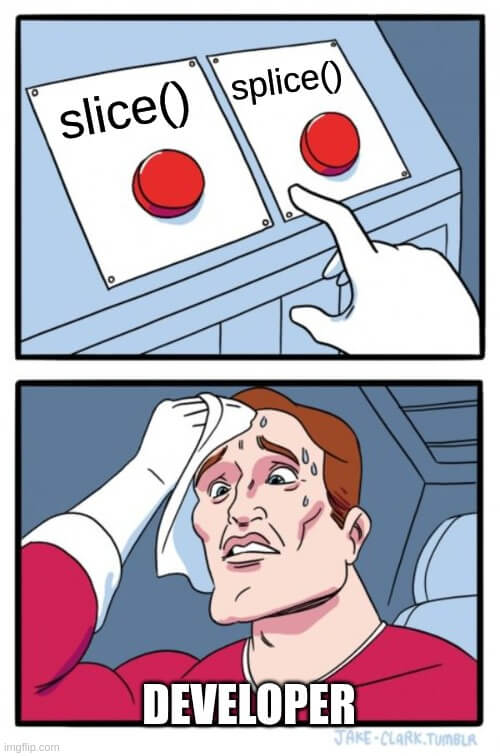

In JavaScript, the `slice()` function is part of both the Array and the String prototype.

This function is used to select *items* or *characters* based on the provided indices.

In this article, you will find all the information needed, for you to become a pro of the `slice()` function.

I will also provide a lot of common use examples that will help you better understand this function.


<Summary />

## Definition

For an array, the `slice()` built-in function is used to select *items* based on the provided indices.

For a string, the `slice()` built-in function is used to select *characters* based on the provided indices.

By using the `start` and the `end` parameters you can specify what portion of the array or string you want to select.

Here is the `slice()` function in action with an array:

```javascript
const languages = ['english', 'french', 'german', 'spanish', 'russian', 'japanese'];

// This will return: ["spanish", "russian", "japanese"]
console.log(languages.slice(3));

// This will return: ["french", "german"]
console.log(languages.slice(1, 3));

// This will return: ["spanish", "russian", "japanese"]
console.log(languages.slice(-3));

// This will return: ["spanish"]
console.log(languages.slice(3, -2));
```

Here is the `slice()` function in action with a string:

```javascript
const str = 'This is a very long string!';

// This will return: "very long string!"
console.log(str.slice(10));

// This will return: "This"
console.log(str.slice(0, 4));

// This will return: "string!"
console.log(str.slice(-7));

// This will return: "string"
console.log(str.slice(-7, -1));
```

This is the syntax of the `slice()` function.

```javascript
arr.slice([ start[, end ]])
```

> `Notes`
> 1. The `slice()` function will NOT modify the original array or string.
> 2. If you don't specify any parameters, the `slice()` function will return a copy of the entire array or string.

### Parameters

| Parameters | Necessity | Description |
| --- | ---- | ----------- |
| start | Optional | The start index of the extraction. |
| end | Optional | The end index before which to extract. |

> **Start Parameter**
> 1. If the start parameter is `undefined`, the extraction will begin at index `ZERO`.
> 2. For an array, if the start parameter is greater than the length of the array, an empty array will be returned.
> 3. For a string, if the start parameter is greater than the length of the string, an empty string will be returned.

> **End Parameter**
> 1. For an array, if the end parameter is omitted, the extraction end index will be `the length of the array`.
> 1. For a string, if the end parameter is omitted, the extraction end index will be `the length of the string`.
> 2. For an array, if the end parameter is greater than the length of the array, the end index will be `the length of the array`.
> 3. For a string, if the end parameter is greater than the length of the string, the end index will be the `length of the string`.

### Return Value

On an array, the `slice()` function will return **a new array containing part of the original array**.

On a string, the `slice()` function will return **a new string containing part of the original string**.

## Browser Support

This method [works on all browsers](https://caniuse.com/?search=slice) since it is an ES1 feature.

| Browser | Support |
| ------- | ------- |
| Chrome | YES ✅ |
| Firefox | YES ✅ |
| Opera | YES ✅ |
| Safari | YES ✅ |
| Edge | YES ✅ |
| Internet Explorer | YES ✅ |


## Examples of the `slice()` function on an array

Here, I've compiled a list of some common use cases for the `slice()` method on an array.

## How to select the first X elements of an array?

To select the first X elements of an array you need to call the `slice()` function with:

1. A `start` parameter of ZERO
2. An `end` parameter

```javascript
const languages = ['english', 'french', 'german', 'spanish', 'russian', 'japanese'];

// This will return: ["english", "french"]
console.log(languages.slice(0, 2));
```

*In this example, we select the first 2 elements from the original array*

## How to select the last X elements of an array?

To select the last X elements of an array you need to call the `slice()` function with a positive `start` parameter.

```javascript
const languages = ['english', 'french', 'german', 'spanish', 'russian', 'japanese'];

// This will return: ["spanish", "russian", "japanese"]
console.log(languages.slice(3));
```

*In this example, we select the last 3 elements.*

## How to clone an array with the `slice()` function?

To clone an array you need to call the `slice()` function without any parameters.

```javascript
const languages = ['english', 'french', 'german', 'spanish', 'russian', 'japanese'];
const newLanguages = languages.slice();
// This will return: ['english', 'french', 'german', 'spanish', 'russian', 'japanese']
console.log(newLanguages);
```

*In this example, we clone the original array and get a new array.*

## Examples of the `slice()` function on a string

I've also compiled a list of some common use cases for the `slice()` method on a string.

## How to get the first X characters of a string?

To get the first X characters of a string you need to call the `slice()` function with:

1. A `start` parameter of ZERO
2. An `end` parameter

```javascript
const str = 'This is a very long string!';

// This will return: "This"
console.log(str.slice(0, 4));
```

*In this example, we get the first 4 characters.*

## How to get the last X characters of a string?

To get the last X characters of a string you need to call the `slice()` with a negative `start` parameter.

```javascript
const str = 'This is a very long string!';

// This will return: "string!"
console.log(str.slice(-7));
```

*In this example, we get the last 7 characters.*

## `slice` vs `splice`

Even tho those two function sounds very alike, they are very different.

The `splice()` function is used to change the content of an array by: 

1. Removing items
2. Replacing existing items/Adding new items in place

The `slice()` function is used to select *items* from an array (based on the provided indices).



Here is a table with all the differences:

| | `splice()` | `slice()` |
| - | - | - |
| Return Value | Returns the removed items in an array | Returns the selected items in an array, as a new array |
| Mutates the original array | YES | NO |
| Parameters | can take N number of parameters | can take 2 parameters |
| Parameter 1 | Index (required) | The start index of the selection (optional) |
| Parameter 2 | The number of items to be removed (optional) | The end index of the selection (optional) |
| Parameter 3 | The new items to be added (optional) | - | 

## Final thoughts

As you can see the `slice()` function is an indispensable method when it comes to working with an array or a string in JavaScript. 

I am sure you will use it very frequently while developing the next billion-dollar startup.

Thank you for reading!