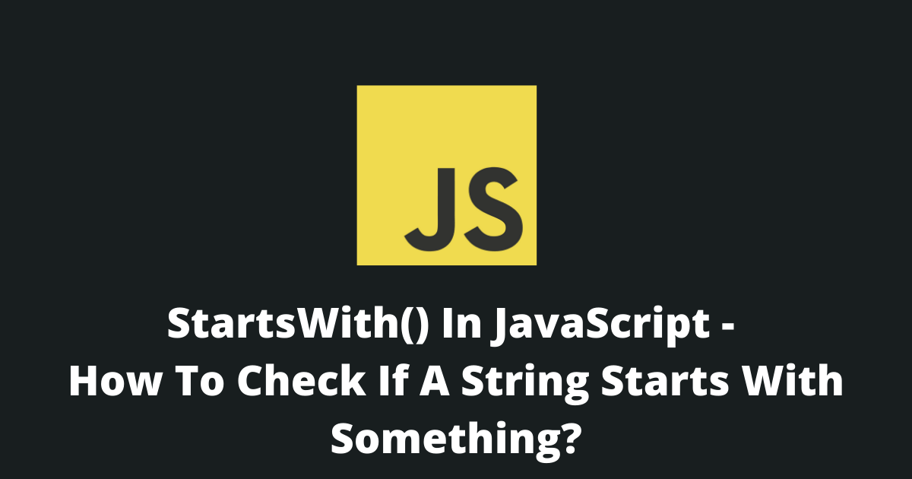
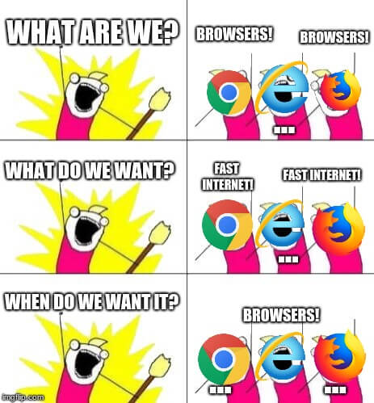

In JavaScript, the easiest way to check if a string starts with something is to use the `startsWith()` function.

This article will tell you everything that you need to know about this function.

By the end of this guide, you will become a pro of this function and you will know:

1. How to use it?
2. When to use it?
3. And, will be able to explain it to others.



<Summary />

## Definition

The `startsWith()` function is used to determine if a string begins by a search value.

If the string begins by the search value, it returns `true`, otherwise, it returns `false`.

```javascript
const str = "This is a very long string!";

// This will return true. ✅
console.log(str.startsWith('This'));

// This will also return true. ✅
console.log(str.startsWith('This is a'));

// This will return false. ❌ 
// startsWith() is case sensitive.
console.log(str.startsWith('this'));

// This will also return false. ❌
console.log(str.startsWith('string'));
```

This is the `startsWith()` function syntax: 

```javascript
str.startsWith(searchValue[, startPosition])
```

Here are some things that you need to take into considerations:

1. This function is [**case sensitive**](https://en.wikipedia.org/wiki/Case_sensitivity).
2. You can specify a start position (completely optional).

### Parameters

| Parameters | Necessity | Description |
| --- | ---- | ----------- |
| searchValue | Required | The value to search for. |
| startPosition | Optional | The default position is 0, but you can specify your own. |

### Return Value

This method will return a `boolean`.

`true` => if the string starts with the search value.

`false` => if the string doesn't start with the search value. 

## Browser Support

This method only works on browsers that support [ES2015](https://caniuse.com/?search=es6).

| Browser | Support |
| ------- | ------- |
| Chrome | YES ✅ |
| Firefox | YES ✅ |
| Opera | YES ✅ |
| Safari | YES ✅ |
| Edge | YES ✅ |
| Internet Explorer | No ❌ |

*To support legacy browsers like Internet Explorer you will need to add a polyfill.* 

[[Get the polyfill here]](#how-to-fix-startswith-is-not-a-function)



## How to make the `startsWith()` function case insensitive?

To make the `startsWith()` function case insensitive you will need to make both the value and the searchValue lowercase.

```javascript
const str = "This is a very long string!".toLowerCase();
const searchValue = "THis".toLowerCase();

// This will return true. ✅
console.log(str.startsWith(searchValue));
```

Alternatively, you can use [the regex method](#how-to-check-if-a-string-starts-with-another-using-a-regex) with the "i" modifier.

## How to use the `startsWith()` function with multiple values?

When you need to check if a string starts with either of multiple values, you can check it in two ways.

1. The Conditional Way

```javascript
const str = "This is a very long string!";

// This will return true. ✅
console.log(str.startsWith('This') || str.startsWith('String'));
```

2. The Array Way, by using the `some()` function to iterate thought the array.

```javascript
const str = "This is a very long string!";

// This will return true. ✅
console.log(['This', 'String'].some(word => str.startsWith(word)));
```

## How to fix "`startsWith()` is not a function"?

There are two main methods to fix this error. 

1. You need to make sure that you are calling this function on a String. This method will only work on a String, so you will need to cast the value into a String.

```javascript
console.log(String(unknownValue).startsWith("This"));
```

2. You need to make sure your browser (or nodeJS) supports ES2015. If your environment doesn't support the new EcmaScript you will need to use add this polyfill before calling the `startsWith()` function.

```javascript
if (!String.prototype.startsWith) {
  String.prototype.startsWith = function (searchValue, position) {
    position = position || 0;

    return this.indexOf(searchValue, position) === position;
  };
}
```

## Are there alternatives to the `startsWith()` function?

Of course. There are a lot of alternatives to the `startsWith()` function. 

You can use the `indexOf()` function, the `substring()` function or a regex.

#### 1. How to check if a string starts with another using `indexOf()`?

You can get the same behavior as the `startsWith()` function by using the `indexOf()` function. 

To replicate the `startsWith()` function, you will need to check if `indexOf()` return position is 0.

```javascript
const str = "This is a very long string!";

// This will return true. ✅
console.log(str.indexOf("This") === 0);

// This will also return true. ✅
console.log(str.startsWith('This'));
```

#### 2. How to check if a string starts with another using `substring()`?

You can check if a string starts with your search value by using the function `substring()` with the length of the search value.

This method is a little more complicated.

```javascript
const str = "This is a very long string!";

// This will return true. ✅
console.log(str.substring(0, 4) === 'This');

// This will also return true. ✅
console.log(str.startsWith('This'));
```

#### 3. How to check if a string starts with another using a regex?

You can check if a string starts with your search value by using a regex.

This is pretty simple to do and you can specify the case sensitivity. To make the search case insensitive add the "i" modifier at the end of the regex.

```javascript
const str = "This is a very long string!";

// This will return true. ✅
const regex = /this/i; 
console.log(regex.test(str));

// This will also return true. ✅
console.log(str.startsWith('This'));
```

## Conclusion

Now that you are a pro of the `startsWith()` function in JavaScript, please share this article with others so they too can become a pro just like you. 


Thanks for reading.