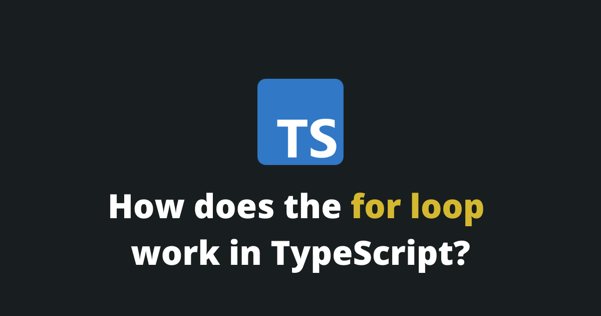

<Summary />

In TypeScript, just like in JavaScript, the `for` loop executes a code block a specified number of times.

Here is an example of the `for` loop in action:

```typescript
for (let i = 0; i < 5; i++) {
	console.log('Iteration ' + i);
}
```

Output:
```typescript
// Iteration 0
// Iteration 1
// Iteration 2
// Iteration 3
// Iteration 4
```

## Syntax of the `for` loop

The default `for` loop is composed of 3 statements.

```typescript
for (statement 1; statement 2; statement 3) {
    // code to be executed.
}
```

| Statement | Execution |Explanation |
| -- | -- | -- |
| statement 1 | Only one time in the beginning. | The looping variable is declared here. |
| statement 2 | Every time before the execution of the code block. | The condition based on which the `for` loop will execute a new iteration of the code. |
| statement 3 | Every time after the execution of the code block. | The looping variable is updated here. |

Those are the steps when a `for` loop executes:

1. Statement 1 is executed. This is where the looping variable is declared.
2. Statement 2 is executed. If the condition is `false` the `for` loop exits.
3. The code block is executed.
4. Statement 3 is executed.
5. Go back to step 2.

## How to loop through an array with the `for` loop.

When you need to loop through an array with the `for` loop, you need to:

1. Initialize the looping variable with `0`.
2. In the condition, ensure the looping variable is less than the array length.
3. Increment the looping variable by `1`.

```typescript
let arr = [ 1, 2, 3, 4, 5 ];
for (let i = 0; i < arr.length; i++) {
	console.log('Array Item: ' + arr[i]);
}
```
Output:
```typescript
// Array Item: 1
// Array Item: 2
// Array Item: 3
// Array Item: 4
// Array Item: 5
```

## How does the `break` statement work?

The `break` statement is used to terminate a `for` loop.

```typescript
for (let i = 0; i < 5; i++) {
	if (i === 2) {
		break;
	}
	console.log('Iteration ' + i);
}
```
Output:
```typescript
// Iteration 0
// Iteration 1
```

In this example, we terminate the `for` loop's execution after the index reaches `2`, so that iterations 2-5 are not executed.

## How does the `continue` statement work?

The `continue` statement is used to skip to the next code iteration of the `for` loop.

```typescript
for (let i = 0; i < 5; i++) {
	if (i === 2) {
		continue;
	}
	console.log('Iteration ' + i);
}
```
Output:
```typescript
// Iteration 0
// Iteration 1
// Iteration 3
// Iteration 4
```

In this example, we skip the code block's execution when the index reaches `2`.

## How does the `for..in` statement work?

The `for..in` statement loops through the **enumerable properties** of an object.

```typescript
const person = {
	age: 26,
	name: 'Tim'
};

for (let prop in person) {
	console.log(prop);
}
```
Output:
```typescript
// age
// name
```

## How does the `for..of` statement work?

The `for..of` statement loops through the **values** of an [iterable object](https://developer.mozilla.org/en-US/docs/Web/JavaScript/Reference/Iteration_protocols).

```typescript
const animals = ["cat", "dog", "cow"];

for (let i of animals) {
	console.log(i);
}
```
Output:
```typescript
// cat
// dog
// cow
```

> P.S. The object must be iterable for this to work. (Array, Map, Set, String, etc...)

## Final Thoughts

Understanding the for loop is detrimental in your path of becoming a developer.

Thank you for reading this article, please share it!