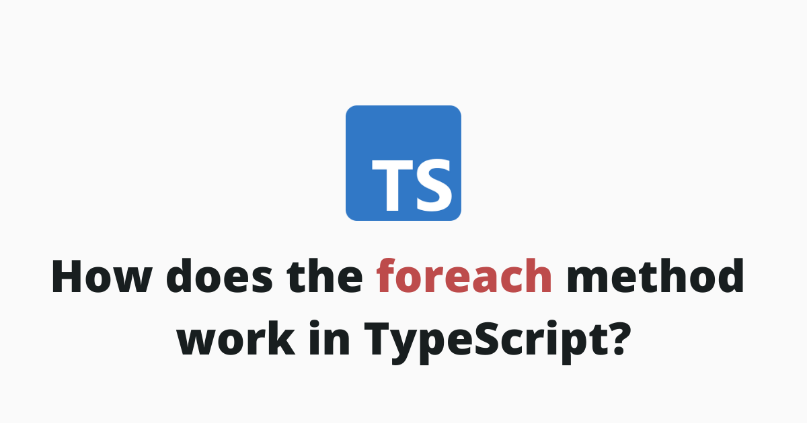

## Definition

> P.S. Unlike the for loop, it is not possible use the `break` and `continue` statements from a forEach method.

### 1. Parameters

### 2. Return Value

## Browser Support

The `forEach()` method works on [all browsers](https://caniuse.com/mdn-javascript_builtins_map_foreach). 🥳

| Browser | Support |
| ------- | ------- |
| Chrome | YES ✅ |
| Firefox | YES ✅ |
| Opera | YES ✅ |
| Safari | YES ✅ |
| Edge | YES ✅ |
| Internet Explorer | YES ✅ |

## How to iterate over an array?

## How to iterate over an object?

## How to iterate over an array of objects?

## How to get key/value pairs with the `forEach()` method?

## How to break out of a `forEach()` method?

## How to use continue in a `forEach()` method?

## How to use `async` and `await` with a `forEach()` method?

## Final Thoughts