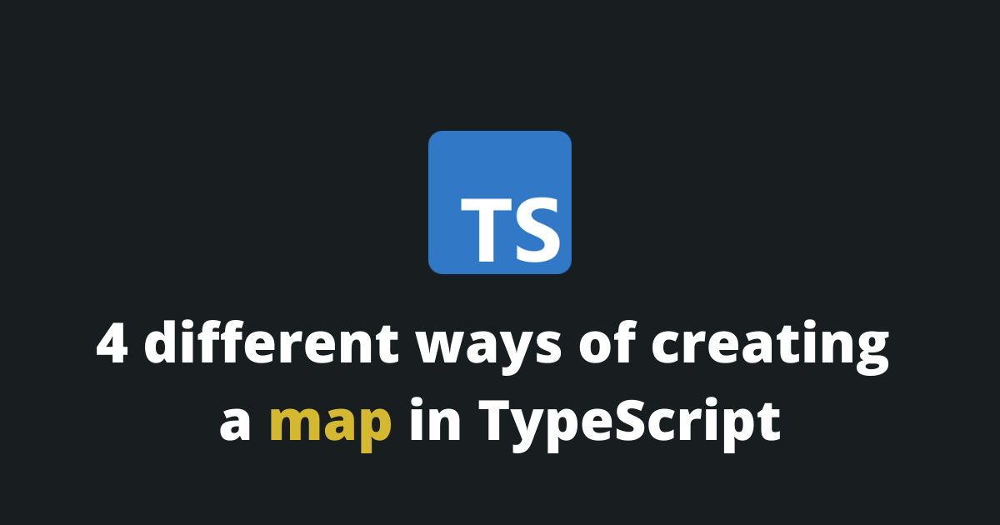
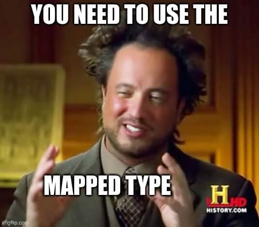
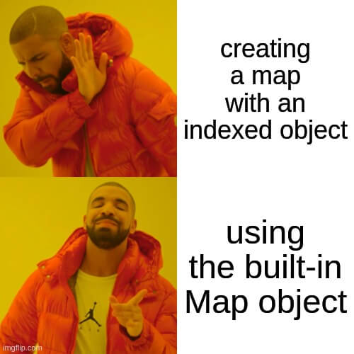

In web development, you often need a data structure to hold a mapping of key/value pairs. This data structure has many names: a map, a dictionary, an associative array... Its functionality, however, always remains the same. The data structure holds key/value pairs and <span className='underline'>one particular key cannot appear more than one time</span>.



**In TypeScript, you have a few easy ways to choose from when you want to create a map.**

1. You can use a simple JavaScript indexed object with a mapped Typescript type (**easiest solution**).
2. You can use an indexed object with the Record utility type.
3. You can use the built-in `Map` structure introduced in the ES6 version of JavaScript.
4. You can use an external library (if you need some special behaviors).

In this article, I will explain all of those solutions, so you will have the knowledge to choose the one that will work the best for you.

<Summary />

## Create a TypeScript map with an indexed object and a mapped type

To create a map in TypeScript with an indexed object and a mapped type you need to follow those steps:

1. We create the mapped type.
2. We initialize the map as an empty object.
3. We add key/value pairs to the map.

```typescript
type MapType = { 
	[id: string]: string; 
}

const map: MapType = {};
map['a'] = 'b';
map['c'] = 'd';
```

Congrats 🎉, we have successfully created a map constant that can be reused in our codebase.

### What is a mapped type in TypeScript?



A mapped type is a type built on the syntax of the index signature. It is very useful when you don’t know the keys of an object ahead of time, and particularly useful in our case since we are working on an indexed object.

```typescript
type MapType = { 
	[id: string]: string; 
}
```

### How to delete a key from a map?

When you need to delete a key from a map you just need to use the `delete` operator.

```typescript
const map: { [id: string]: string; } = {};
map['a'] = 'b';
map['c'] = 'd';

delete map['c'];

// Output: undefined
console.log(map['c']);
```

### How to iterate through a map?

You can iterate through a map using the `for` loop and get each key/value pair.

```typescript
for (let i in map) {
	console.log(map[i]);
}
```

[[Learn more about the for loop]](/blog/typescript-for-loop)

### How to verify if a map contains a key?

Since a map can only contain unique keys, you can verify if a map contains a key simply by calling the map with the key as the index. If the key exists, that means that the map contains the key/value pair.

```typescript
const map: { [id: string]: string; } = {};
map['a'] = 'b';

// Outputs: 'b'
console.log(map['a']);

// Outputs: 'undefined'
console.log(map['c']);
```

### How to get the keys of a map?

To get all the keys in an array from a map you need to call the `Object.keys()` built-in function.

```typescript
const map: { [id: string]: string; } = {};
map['a'] = 'b';
map['c'] = 'd';

// Outputs: [ 'a', 'c' ]
console.log(Object.keys(map));
```

## Create a TypeScript map with the Record utility type

Another way of creating a map in TypeScript is to utilize the `Record` utility type. 

We are still going to create an indexed object so, all of the methods above will work on this method too, but we will change the type.

The `Record` type is a pre-defined TypeScript utility type and it has the following structure.

```typescript
Record<Keys, Type>
```

The `Record` type is a great way of simplifying the type definitions for a map.

```typescript
const map: Record<string, string> = {};
map['a'] = 'b';
map['c'] = 'd';
```

### What is the difference between a map and a record?

Some confusion may occur when comparing a map and a record. This confusion occurs because those two entities shouldn’t be compared at all, they are two different things.

The map is a data structure and is the same in both JavaScript and TypeScript.

The `Record` is a type definition for the map and is only accessible while using TypeScript.

## Create a TypeScript map using the ES6 Map Object




If you are only using browsers with ES6 capabilities you can use the built-in `Map` object. The advantage of using this structure is:

1. You don’t need to declare a new type.
2. You have access to a lot of built-in methods that are much more explicit.

This is how you initialize a map in TypeScript:

```typescript
const map = new Map<string, string>();
map.set('a', 'b');
map.set('c', 'd');
```

### ES6 Map Methods

While using the `Map` object you have access to methods with explicit names that are easier to understand to new developers.

| Method | Description |
| ------ | ----------- |
| map.set(key, value) | Adds a key/value pair to the map. |
| map.get(key) | Returns the value for a key in the map. |
| map.clear() | Clears all the elements in the map. |
| map.delete(key) | Removes a key/value pair specified by the key. |
| map.has(key) | Returns true if the map contains the key. |
| map.entries() | Returns an iterator object with key/value pairs. | 
| map.keys() | Returns an iterator object with the keys. |
| map.values() | Returns an iterator object with the values. |
| map.forEach(callback(value, key)) | Invokes a callback on each key/value pair. |

[[Learn more about the foreach loop]](/blog/typescript-foreach)

### Map Polyfill

If you plan on supporting old browsers, like Internet Explorer, the `Map` object will not exist and you will need to add a polyfill to your code.

Here are my favorite polyfills:

1. The [core-js library](https://www.npmjs.com/package/core-js) provides a `Map` polyfill. The advantage of using core-js is that the library provides other polyfills as well.
2. The [es6-map library](https://www.npmjs.com/package/es6-map), if you only need the Map polyfill.

## Create a TypeScript map using an external library


You can also use an existing map from an external library (if you need some special behavior). I recommend using either the [immutable](https://www.npmjs.com/package/immutable) library or the [mnemonist](https://www.npmjs.com/package/mnemonist) library.

### Immutable npm library

The advantage of using the immutable npm library is that once the data is created you cannot modify it. That means:

1. Simpler application development
2. No-defense copying
3. Advanced memoization
4. Simpler logic

This is how you create a map with the immutable library:

```typescript
import Immutable from 'immutable';

const map = Immutable.Map<string, string>({ a: 'b', c: 'd' });
```

### mnemonist npm library

It is a curated collection of data structures for TypeScript & JavaScript.

It supports a lot of different non-trivial data structures. 

For example, it supports a lot of different map variations for very specific use cases that a developer might have:

- MultiMap
- TrieMap
- SparseMap
- FuzzyMap
- FuzzyMultiMap

## Final Thoughts

Whether or not you will choose to develop your map implementation or will use an existing library, the map data structure is one of the most important concepts to master for a web developer. 

Personally, most of the time, when I need to create a map I just use an indexed object with the mapped type. I found it is the easiest solution and, most of the time, I don’t need any special behavior that would require an external npm library.

Thank you for reading this article, please share it!