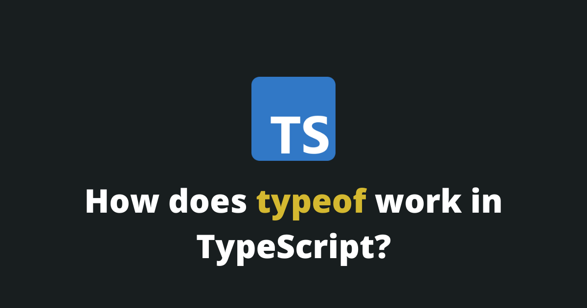

TypeScript just like JavaScript has a special `typeof` operator, but it has a different meaning.

In TypeScript, `typeof` is used to refer to *a type of a variable in a type context*.

```typescript
let v = 'This is a string';
type Date: typeof v;
```
In that case, the `Data` type will have this structure:

```typescript
type Data = string;
```

Maybe you have noticed, but, in this particular example, this is not very useful, since the type is a basic type... You are right! But, the `typeof` operator becomes very handy with complex types.

```typescript
let person = {
	name: 'Tim',
	age: 26,
	list: {
		element1: true
	}
};

type Data: typeof p;
```

In that case, the `Data` type will have this structure:

```typescript
type Data = {
	name: string;
	age: number;
	list: {
		element1: boolean;
	};
};
```

In that example, we create a type based on the `person` variable, that we can latter use to match other variables.

## How to get the type from array elements?

In TypeScript, you can transform elements from an array into a type using the `const` keyword.

```typescript
const animals = [ 'dog', 'cat', 'elephant' ] as const;
type Data = typeof animals[number];
```
In that case, the `Data` type will have this structure:

```typescript
type Data = 'dog' | 'cat' | 'elephant';
```

This also work on an array of objects!

```typescript
const animals = [
    { age: 3, type: 'dog' },
    { age: 4, type: 'cat' }
];
type Data = (typeof animals)[number];
```

In that case, the `Data` type will have this structure:

```typescript
type Data = {
	age: number;
	type: string;
};
```

## How does `keyof typeof` work in TypeScript?

<Summary />